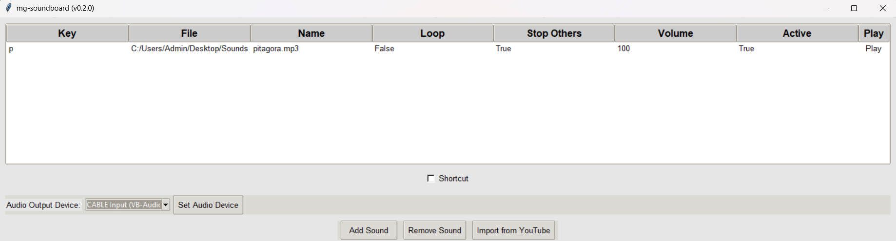
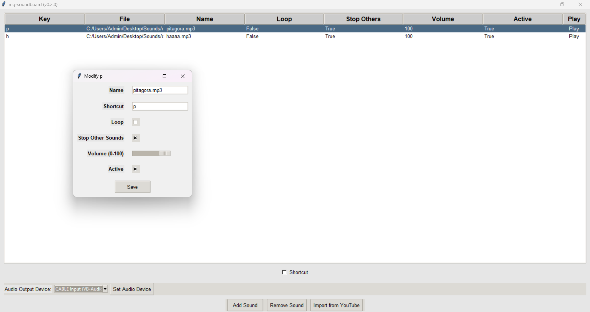

# mg-soundboard - 100% gratis 

Benvenuti nel progetto **mg-soundboard**! Questa applicazione è una soundboard gratuita e personalizzabile che consente di gestire e riprodurre file audio tramite scorciatoie da tastiera. È stata progettata per essere facile da usare e altamente configurabile.

<div>
    
    
</div>

## Caratteristiche

- **Gestione dei suoni**: Aggiungere (o importare da YT), rimuovere e modificare facilmente i suoni.
- Scorciatoie da tastiera**: Assegnazione e modifica delle scorciatoie da tastiera per ogni suono.
- Impostazioni personalizzabili**:
  - **Loop**: Imposta se il suono deve essere ripetuto in un ciclo.
  - **Interrompi altri suoni**: Scegliere se interrompere gli altri suoni quando questo suono viene riprodotto (l'impostazione predefinita è Vero).
  - **Volume**: Regola il volume del suono (l'impostazione predefinita è 100%).
  - **Attiva**: Attiva o disattiva il suono.
  - Riproduzione**: Riproduce il brano.
- **Corciatoie globali**: Attiva o disattiva la funzionalità delle scorciatoie globali.
- Salvataggio della configurazione**: Le impostazioni e i suoni vengono salvati automaticamente e ripristinati alla riapertura dell'applicazione.
- Nuovo (v.0.2.0) Imposta dispositivo audio**: Selezionare un dispositivo dall'elenco e fare clic su “Imposta dispositivo audio”. (Per ulteriori informazioni, vedere [changelog.txt](changelog.txt)).

Il changelog completo [qui](changelog.txt).
## Installazione

1. **Clonare il repository**:

    ```bash
    git clone https://github.com/Axel00x/mg-soundboard.git
    cd mg-soundboard
    ```

2. **Installare le dipendenze**:

    Assicurarsi di avere installato Python 3.x, quindi eseguire:

    ```bash
    pip install -r requirements.txt
    ```

    Il file `requisiti.txt` include tutti i file 

Tradotto con DeepL.com (versione gratuita)